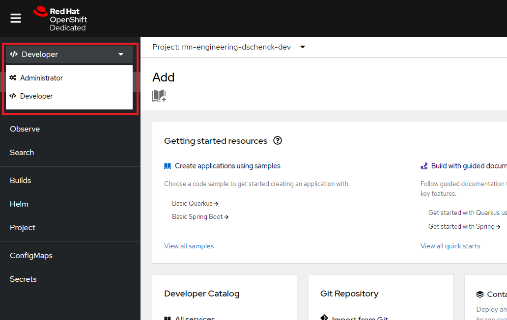
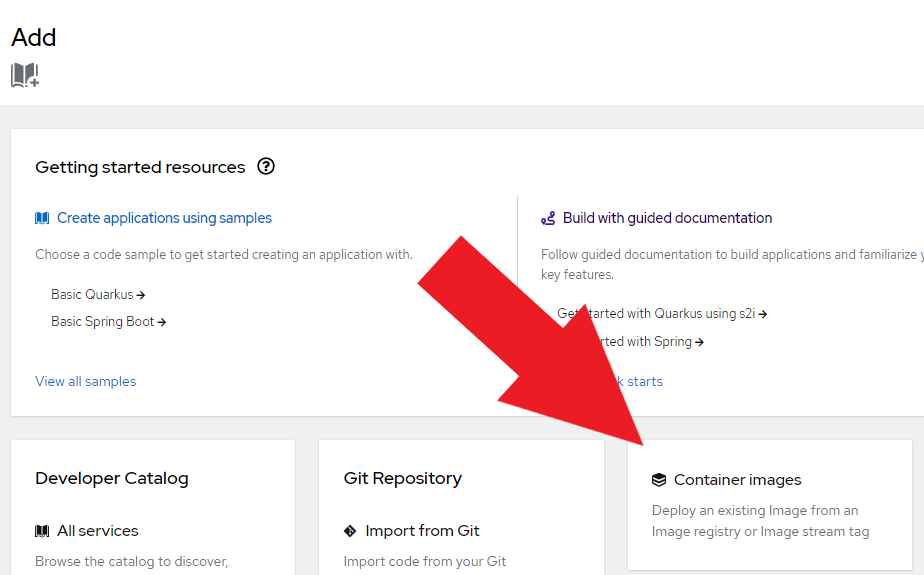
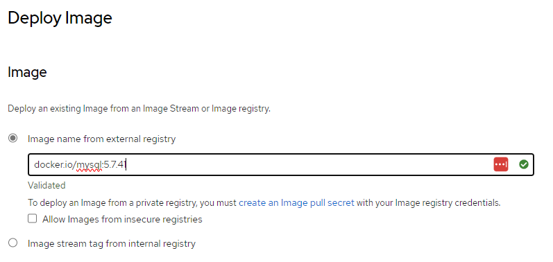
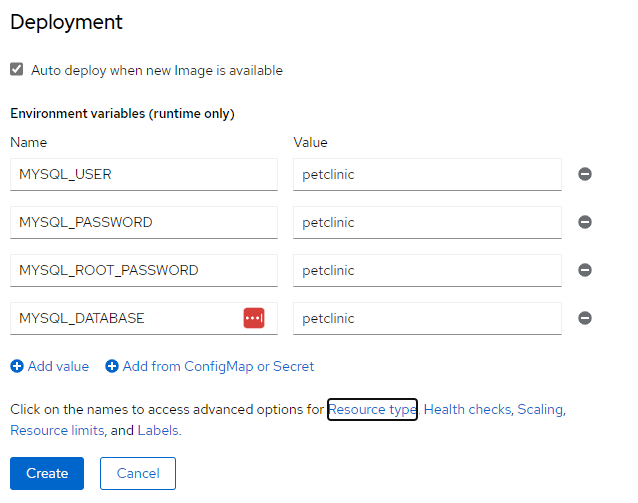
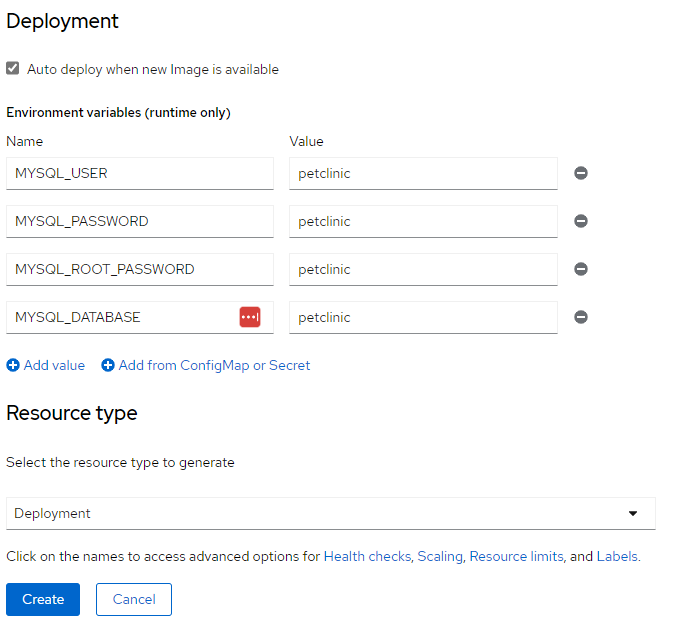
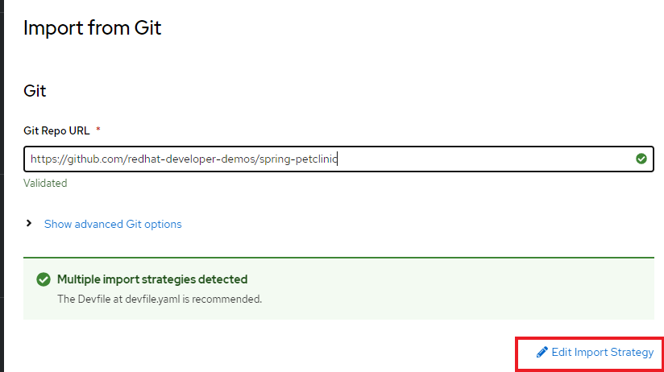
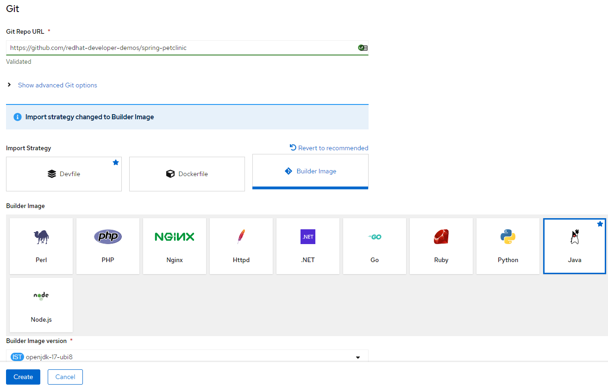
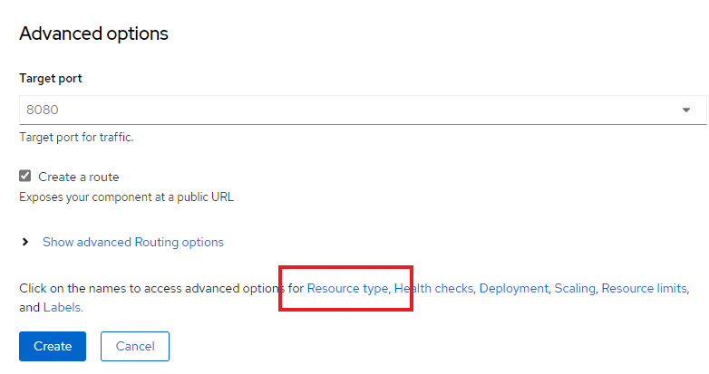
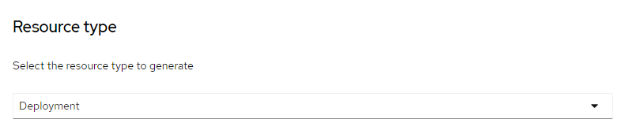
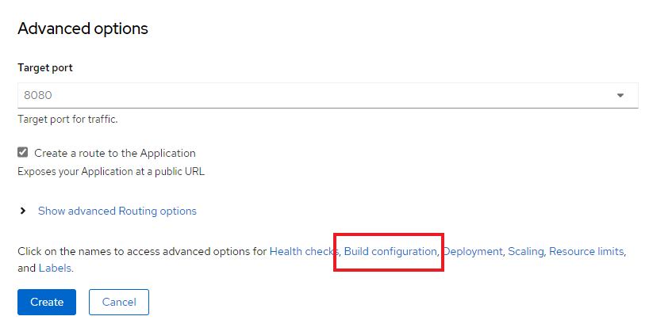

# Spring Pet Clinic and the Developer Sandbox for Red Hat OpenShift

This repo contains a container-ready implementation of the iconic Spring Petclinic application. Specifically, this code is useful with the OpenShift Source-to-Image (s2i) technology and is part of the introductory material for [Developer Sandbox for Red Hat OpenShift](https://developers.redhat.com/developer-sandbox).

## OpenShift Implementation
Get your *free*  OpenShift cluster to run this demo. You can get free access to Developer Sandbox for Red Hat OpenShift at: https://developers.redhat.com/developer-sandbox


### Dev Console

Make sure you are in the Developer perspective:

  

The first step is create a database to hold our data. We'll use a MySQL Image to do this.

Click the `+Add` button and choose the `Container images` option:  



Enter the MySQL image we need, `docker.io/mysql:5.7.41`  


  

Scroll to the bottom of the page and select the option to access advanced options for a Deployment:


Using the Environment variables section, specify the database and authentication values by adding the following four environment variables.  



When they are entered, click the "Resource type" link. Select "Deployment" as the Resource type:  


  

Click the `Create` button. 

After a few minutes, and behind the scenes, a MySQL database container will be started. At this point, you have a database engine to be used by the application. Time to move on and create the application.

### Deploy Pet Clinic App


Click the `+Add` button and choose `Import from Git` type:

Fill the git repo with the following value `https://github.com/redhat-developer-demos/spring-petclinic`. This is where things get interesting.

When you enter the URL for a git repo, OpenShift will look at the files in the repo and attempt to discern the best way to build the application. There are three possible results:  
1. Build using the file "devfile.yaml" found in the source code
1. Build using the file "dockerfile" found in the source code
1. If neither of the above two files are found, build using a builder image and the built-in source-to-image (s2i) technology. This is the focus of this article.

If, the case of this example (i.e. Spring Petclinic), OpenShift does **not** choose the builder image option, you will need to direct it to do so. Here's how to do that:

First, click on the "Edit Import Strategy" link:

  

Next, choose the Builder Image option and make sure the Java builder is selected:



Scroll down to the Advanced options section and select the option to change the Resource type:

  

Choose the Deployment option:  

  

Near the bottom of the page, click the `Build Configuration` link:



Add the following environment variables, as displayed in the following screen capture:

```
SPRING_PROFILES_ACTIVE=mysql
MYSQL_URL=jdbc:mysql://mysql:3306/petclinic
```


Finally click the `Create` button and wait until the Build is done and the Pod is up and running (dark blue around the deployment bubble). In testing this using the Developer Sandbox for Red Hat OpenShift, this step took approximately six minutes. Please note: You *may* see error messages in the Sandbox. They are temporary while the application builds.  

Then push the Open URL button to view the Pet Clinic app:


And if you visit the MySQL deployment's Terminal then you connect to the database to see the schema and data


```
mysql -u root -h mysql -p

petclinic

use petclinic;
show tables;
```


```
select * from owners;
```


`### End ###`
